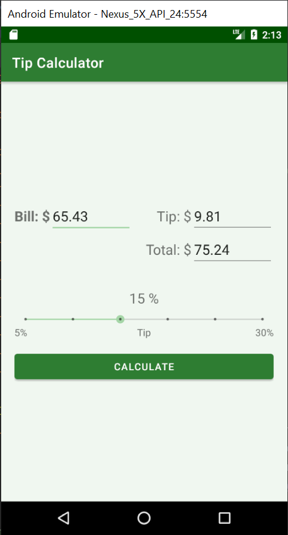

# tip-calculator
* Android Studio project. This app calculates tips.
* User enters the amount billed, selects a tip % between 5% and 30% on the Seek Bar, and taps Calculate.
* The app displays the tip amount and total bill.

